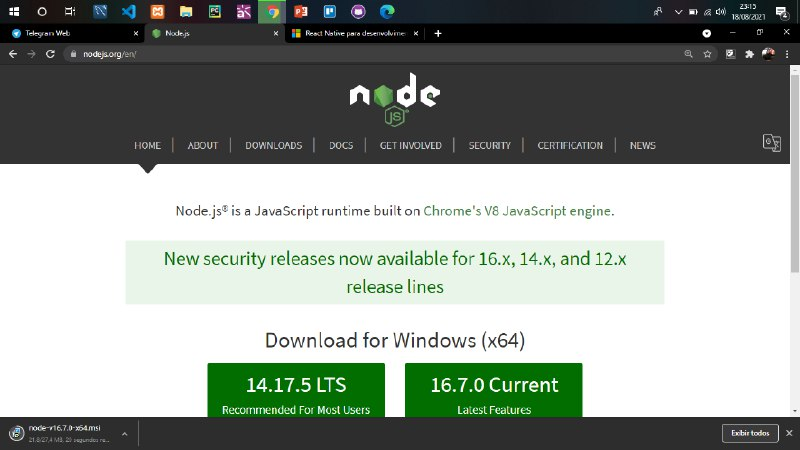

## Android Studio

Para instalar o Android Studio no Windows, você deve ficar atento aos tópicos abaixo:
* Se você fez o download de um arquivo **.exe(recomendado)**, clique nele duas vezes para iniciá-lo.
* Se você fez o download de um arquivo **.zip**, descompacte o ZIP, copie a pasta android-studio para a pasta Arquivos de Programas. Em seguida, abra a pasta **android-studio**, acesse o **bin** e execute **studio64.exe** (para máquinas de 64 bits) ou **studio.exe** (para máquinas de 32 bits).
* Após realizadas as instruções, siga as etapas do assistente de configuração no Android Studio e instale todos os pacotes do SDK recomendados.

## Node

A instalação do Node no Windows é relativamente simples, basta acessar o site oficial, disponível [aqui](https://nodejs.org/en/) e fazer download do instalador. Até a escrita deste artigo a versão Current do Node é 16.7.0.
O link redirecionará você para uma página como mostra abaixo:

Execute o instalador, siga as instruções na tela e pronto, o Node está instalado e adicionado ao PATH do Windows. Feche todos os terminais abertos e você está pronto para prosseguir.

## React Native

Para utilizá-lo, você precisa verificar as dependências necessárias abaixo:
* Primeiro, instale o **Visual Studio Code** (ou o editor de códigos de sua preferência). Caso já esteja instalado, siga para o próximo tópico.
* Instale o **Android Studio** para Windows. Por padrão, o Android Studio instala o último SDK do Android. O React Native exige o SDK do Android 6.0 (Marshmallow) ou superior. Recomendamos usar o último SDK.
* Atenção para a seguinte etapa: você deve criar caminhos de variável de ambiente para o SDK do Java e o SDK do Android: no menu de pesquisa do Windows, insira: "Editar as variáveis de ambiente do sistema". Isso abrirá a janela Propriedades do Sistema. Escolha Variáveis de Ambiente… e Novo… em Variáveis de usuário.
Insira o nome da variável e o valor (caminho). Os caminhos padrão para os SDKs do Java e do Android são mostrados a seguir. Se você tiver escolhido uma localização específica para instalar os SDKs do Java e do Android, atualize os caminhos de variável de acordo.